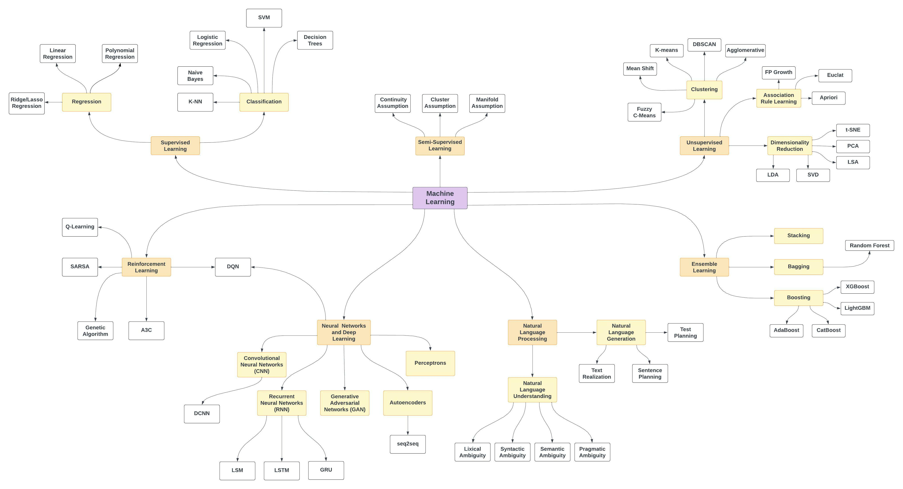

# Homemade Machine Learning (Aprendizaje automatico casero)

> UA UCRANIA [ESTÁ SIENDO ATACADA](https://war.ukraine.ua/) POR EL EJERCITO RUSO. CIVILES ESTAN SIENDO ASESINADOS. AREAS RESIDENCIALES ESTAN SIENDO BOMBARDEADAS.
> Ayuda a Ucrania via [National Bank of Ukraine](https://bank.gov.ua/en/news/all/natsionalniy-bank-vidkriv-spetsrahunok-dlya-zboru-koshtiv-na-potrebi-armiyi)
> - Ayuda a Ucrania via [SaveLife](https://savelife.in.ua/en/donate-en/) fund
> - Más información en [war.ukraine.ua](https://war.ukraine.ua/) y [MFA of Ukraine](https://twitter.com/MFA_Ukraine)

<hr/>

[](https://mybinder.org/v2/gh/trekhleb/homemade-machine-learning/master?filepath=notebooks)

> _También te podría interesar 🤖 [Interactive Machine Learning Experiments](https://github.com/trekhleb/machine-learning-experiments)_

_Para la versión en Octave/MatLab de este repositiorio, visita [machine-learning-octave](https://github.com/trekhleb/machine-learning-octave) project._

> Este repositorio contiene ejemplos de algoritmos populares en machine learning implementados en **Python** con los racionales matemáticos explicados. Cada algoritmo tiene un **Jupiter Notebook** interactive asociado que te permite jugar con la data, la configuración de los algoritmos e inmediatamente ver los resultados, gráficas y predicciones **directamente en tu explorador**. En la mayoría de los casos las explicaciones están basadas en [this great machine learning course](https://www.coursera.org/learn/machine-learning) por Andrew Ng.

El propósito de este repositorio _no_ es de implementar algoritmos de machine learning utilizando bibliotecas desarrolladas por 3<sup>eros</sup> que consisten en comandos de una linea. El propósito es practicar la implementación de estos algoritmos desde zero y por consiguiente mejorar el entendimieno de la matematica detrás de cada algoritmo. Es por esto que todas las implementaciones son llamadas "caseras" y no están hachas para ser utilizadas fuera de un contexto didáctico.

## Supervised Learning (Aprendizaje supervisado)

En este tipo de algoritmos contamos con un set de data de entrenamiento (training data) como entrada y un set de etiquetas o "respuestas correctas" correspondiente con ladata de entrada que serviran como salida. El propósito es entrenar nuestro modelo (parametros del algoritmo) para emparejar los datos de entrada con los de salida correctamente (hacer predicciones correctas). Esto con el fin de encontrar los parametros del modelo que continuaran este emparejamiento (correcto) de _entrada+salida_ con nuevos datos.

### Regression (Regresión)

En problemas de regresión hacemos predicciones de datos reales. Básicamente intentamos dibujar una linea/plano através de los ejemplos de entrenamiento. 

_Ejemplos de uso: pronostico de precios de acciones, análisis de ventas, dependencias numericas, etc..._

#### 🤖 Linear Regression (Regresión linear)

- 📗 [Math | Linear Regression](homemade/linear_regression) - teoría y más para leer (en inglés)
- ⚙️ [Code | Linear Regression](homemade/linear_regression/linear_regression.py) - ejemplo de implementación
- ▶️ [Demo | Univariate Linear Regression (Regresión univariable)](https://nbviewer.jupyter.org/github/trekhleb/homemade-machine-learning/blob/master/notebooks/linear_regression/univariate_linear_regression_demo.ipynb) - predecir la evaluacion de `country happiness (felicidad en el país)` usando `economy GDP (producto interno bruto)`
- ▶️ [Demo | Multivariate Linear Regression(Regresión multivariable)](https://nbviewer.jupyter.org/github/trekhleb/homemade-machine-learning/blob/master/notebooks/linear_regression/multivariate_linear_regression_demo.ipynb) - predecir la evaluacion de `country happiness (felicidad en el país)` usando `economy GDP (producto interno bruto)` y `freedom index (índice de libertad)`
- ▶️ [Demo | Non-linear Regression](https://nbviewer.jupyter.org/github/trekhleb/homemade-machine-learning/blob/master/notebooks/linear_regression/non_linear_regression_demo.ipynb) - usar regresión linear con caracteristicas _polinimiales_ y _sinusoidales_ para predecir dependencias no-lineales

### Classification (Clasificación)

En problemas de clasificación no contamos con etiquetas o "respuestas correctas". En este tipo de problemas dividimos la data de entrada en grupos dependiendo sus características. 

_Ejemplos de uso: filtros de spam, detección de lenguaje, encontrar documentos similares, reconocimiento de letras escritas a mano, etc..._

#### 🤖 Logistic Regression (Regresión logística)

- 📗 [Math | Logistic Regression](homemade/logistic_regression) - teoría y más para leer (en inglés)
- ⚙️ [Code | Logistic Regression](homemade/logistic_regression/logistic_regression.py) - ejemplo de implementación
- ▶️ [Demo | Logistic Regression (Linear Boundary)](https://nbviewer.jupyter.org/github/trekhleb/homemade-machine-learning/blob/master/notebooks/logistic_regression/logistic_regression_with_linear_boundary_demo.ipynb) - predecir la `class (clase)` de flor basado en `petal_length (longitud del pétalo)` y `petal_width (ancho del pétalo)`
- ▶️ [Demo | Logistic Regression (Non-Linear Boundary)](https://nbviewer.jupyter.org/github/trekhleb/homemade-machine-learning/blob/master/notebooks/logistic_regression/logistic_regression_with_non_linear_boundary_demo.ipynb) - predicir la `validity (validez)` de un microchip basado en `param_1` y `param_2`
- ▶️ [Demo | Multivariate Logistic Regression | MNIST](https://nbviewer.jupyter.org/github/trekhleb/homemade-machine-learning/blob/master/notebooks/logistic_regression/multivariate_logistic_regression_demo.ipynb) - reconocer números escritos a mano en imagenes de `28x28` pixeles 
- ▶️ [Demo | Multivariate Logistic Regression | Fashion MNIST](https://nbviewer.jupyter.org/github/trekhleb/homemade-machine-learning/blob/master/notebooks/logistic_regression/multivariate_logistic_regression_fashion_demo.ipynb) - reconocer artículos de ropa en imagenes de `28x28` pixeles 

## Unsupervised Learning (Aprendizaje no supervisado)

Aprendizaje no supervisado es una rama del machine learning que aprende de data que no ha sido etiquetada, clasificada o categorizada. En lugar de aprender de retoralimentación, unsupervised learning identifica caracteristicas en común de la data y reacciona de acuerdo a la presencia (o ausencia) de estas caracteristicas en data nueva.  

### Clustering (Clústering)

En problemas de clústering dividimos los ejemplos de entrenamiento por caracteristicas desconocidas. El algoritmo en si decide que caracteristicas usa para hacer esta división.

_Ejemplos de uso: segmentación de mercados, analysis de redes sociales, organizar clústers de cómputo, análisis de data astronómica, compresión de imagenes, etc..._

#### 🤖 K-means Algorithm (Algoritmo K-means)

- 📗 [Math | K-means Algorithm](homemade/k_means) - teoría y más para leer (en inglés)
- ⚙️ [Code | K-means Algorithm](homemade/k_means/k_means.py) - ejemplo de implementación
- ▶️ [Demo | K-means Algorithm](https://nbviewer.jupyter.org/github/trekhleb/homemade-machine-learning/blob/master/notebooks/k_means/k_means_demo.ipynb) - dividir flores en clústers basandonos en `petal_length (longitud del pétalo)` y `petal_width (ancho del pétalo)`

### Anomaly Detection (Detección de anomalías)

La detección de anomalías es la identificación de articulos, eventos o observaciones raras que levantan sospechas ya que difieren significativamente de la mayoría de la data. 

_Ejemplos de uso: detección de intrusos, detección de fraude, monitoreo de la salud del sistema, remover data anómala de un set, etc..._

#### 🤖 Anomaly Detection using Gaussian Distribution (Detección de anomalías utilizando la Distribución Normal)

- 📗 [Math | Anomaly Detection using Gaussian Distribution](homemade/anomaly_detection) - teoría y más para leer (en inglés)
- ⚙️ [Code | Anomaly Detection using Gaussian Distribution](homemade/anomaly_detection/gaussian_anomaly_detection.py) - ejemplo de implementación
- ▶️ [Demo | Anomaly Detection](https://nbviewer.jupyter.org/github/trekhleb/homemade-machine-learning/blob/master/notebooks/anomaly_detection/anomaly_detection_gaussian_demo.ipynb) - encontrar anomalías en los parametros de servicio de un servidor como `latency` y `threshold`

## Neural Network (NN) (Redes Neurales)

Las NN en si no son un algoritmo, más bien son un marke de referencia para el uso de varios algoritmos juntos y el procesamiento de data compleja. 

_Ejemplos de uso: como un substituto sobre todos los demás algoritmos en general, reconocimiento de imagenes, procesamiento de imagened (aplicando cierts estilos), traducciones, etc..._

#### 🤖 Multilayer Perceptron (MLP) (Perceptrón de multiples capas)

- 📗 [Math | Multilayer Perceptron](homemade/neural_network) - teoría y más para leer (en inglés)
- ⚙️ [Code | Multilayer Perceptron](homemade/neural_network/multilayer_perceptron.py) - ejemplo de implementación
- ▶️ [Demo | Multilayer Perceptron | MNIST](https://nbviewer.jupyter.org/github/trekhleb/homemade-machine-learning/blob/master/notebooks/neural_network/multilayer_perceptron_demo.ipynb) - reconocer números escritos a mano en imagenes de `28x28` pixeles
- ▶️ [Demo | Multilayer Perceptron | Fashion MNIST](https://nbviewer.jupyter.org/github/trekhleb/homemade-machine-learning/blob/master/notebooks/neural_network/multilayer_perceptron_fashion_demo.ipynb) - reconocer artículos de ropa en imagenes de `28x28` pixeles 

## Mapa de Machine Learning (inglés)



La fuente de este mapa es [este maravilloso blog post](https://vas3k.ru/blog/machine_learning/)

## Prerequisitos

#### Instalación de Python

Asegura de tener [Python instalado](https://realpython.com/installing-python/) en tu computadora.

Recomendamos utilizar la biblioteca estándar de Pyton [venv](https://docs.python.org/3/library/venv.html) para crear un ambiente virtual y tener Python, `pip` y todos los paquetes dependientes instalados y entregados desde el directorio del proyecto directamente para evitar problemas con cambios globales de los paquetes y sus versiones.

#### Instalar las dependencias

Instala todas las dependencias requeridas para el proyecto ejecutando:

```bash
pip install -r requirements.txt
```

#### Lanzar Jupyter Localmente

Todas las demonstraciones en este proyecto pueden ser ejecutadas directamnte en tu navegador sin necesidad de instalar Jypyter localmente. Sin embargo, si queres lanzar [Jupyter Notebook](http://jupyter.org/) localmente, es probable que lo quieras hacer utilizando el siguiente comando desde la carpeta raíz del proyecto:

```bash
jupyter notebook
```
Después de esto, el Jupyter Notebook se puede accesar a través de `http://localhost:8888`.

#### Lanzar Jupyter de manera remota

Cada sección dedicada a un algoritmo contiene enlaces a [Jupyter NBViewer](http://nbviewer.jupyter.org/). Esta es una herramienta onlina muy veloz para pre-vizualisar el código, los graficos y la data desde tu navegador sin necesidad de instalar nada localmente. En el caso que quieras _camnbiar_ el código y _experimentar_ con el notebook, tienes que lanzarlo desde [Binder](https://mybinder.org/). Puedes hacerlo simplemente con hacer clock en _"Execute on Binder"_ en la esquina superior derecha de NBViewer.


## Datasets

La lista de los datasets que son utilizados en los demos se encuentra ubicada en [data folder](data).

## Apoyo al proyecto

Puedes apoyar el proyecto vía ❤️️ [GitHub](https://github.com/sponsors/trekhleb) o ❤️️ [Patreon](https://www.patreon.com/trekhleb).

## Autor

- [@trekhleb](https://trekhleb.dev)
