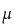
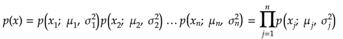
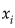
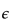

# Anomaly Detection Using Gaussian Distribution

## Jupyter Demos

▶️ [Demo | Anomaly Detection](https://nbviewer.jupyter.org/github/trekhleb/homemade-machine-learning/blob/master/notebooks/anomaly_detection/anomaly_detection_gaussian_demo.ipynb) - find anomalies in server operational parameters like `latency` and `threshold`

## Gaussian (Normal) Distribution

The **normal** (or **Gaussian**) **distribution** is a very common continuous probability distribution. Normal distributions are important in statistics and are often used in the natural and social sciences to represent real-valued random variables whose distributions are not known. A random variable with a Gaussian distribution is said to be normally distributed and is called a normal deviate.

Let's say:

If _x_ is normally distributed then it may be displayed as follows.

 - mean value,

 - variance.

 - "~" means that _"x is distributed as ..."_

Then Gaussian distribution (probability that some _x_ may be a part of distribution with certain mean and variance) is given by:

## Estimating Parameters for a Gaussian

We may use the following formulas to estimate Gaussian parameters (mean and variation) for _ith_ feature:

 - number of training examples.

 - number of features.

## Density Estimation

So we have a training set:

We assume that each feature of the training set is normally distributed:

Then:

## Anomaly Detection Algorithm

1. Choose features  that might be indicative of anomalous examples ().
2. Fit parameters  using formulas:

3. Given new example _x_, compute _p(x)_:

Anomaly if 

 - probability threshold.

## Algorithm Evaluation

The algorithm may be evaluated using _F1_ score.

The F1 score is the harmonic average of the precision and recall, where an F1 score reaches its best value at _1_ (perfect precision and recall) and worst at _0_.

Where:

_tp_ - number of true positives.

_fp_ - number of false positives.

_fn_ - number of false negatives.

## References

- [Machine Learning on Coursera](https://www.coursera.org/learn/machine-learning)
- [Normal Distribution on Wikipedia](https://en.wikipedia.org/wiki/Normal_distribution)
- [F1 Score on Wikipedia](https://en.wikipedia.org/wiki/F1_score)
- [Precision and Recall on Wikipedia](https://en.wikipedia.org/wiki/Precision_and_recall)
  