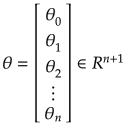
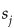
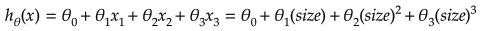
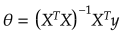
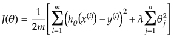
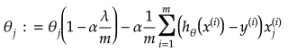

# Linear Regression

## Jupyter Demos

▶️ [Demo | Univariate Linear Regression](https://nbviewer.jupyter.org/github/trekhleb/homemade-machine-learning/blob/master/notebooks/linear_regression/univariate_linear_regression_demo.ipynb) - predict `country happiness` score by `economy GDP`

▶️ [Demo | Multivariate Linear Regression](https://nbviewer.jupyter.org/github/trekhleb/homemade-machine-learning/blob/master/notebooks/linear_regression/multivariate_linear_regression_demo.ipynb) - predict `country happiness` score by `economy GDP` and `freedom index`

▶️ [Demo | Non-linear Regression](https://nbviewer.jupyter.org/github/trekhleb/homemade-machine-learning/blob/master/notebooks/linear_regression/non_linear_regression_demo.ipynb) - use linear regression with _polynomial_ and _sinusoid_ features to predict non-linear dependencies.

## Definition

**Linear regression** is a linear model, e.g. a model that assumes a linear relationship between the input variables (_x_) and the single output variable (_y_). More specifically, that output variable (_y_) can be calculated from a linear combination of the input variables (_x_).

On the image above there is an example of dependency between input variable _x_ and output variable _y_. The red line in the above graph is referred to as the best fit straight line. Based on the given data points (training examples), we try to plot a line that models the points the best. In the real world scenario we normally have more than one input variable.

## Features (variables)

Each training example consists of features (variables) that describe this example (i.e. number of rooms, the square of the apartment etc.)

_n_ - number of features

_Rn+1_ - vector of _n+1_ real numbers

## Parameters

Parameters of the hypothesis we want our algorithm to learn in order to be able to do predictions (i.e. predict the price of the apartment).

## Hypothesis

The equation that gets features and parameters as an input and predicts the value as an output (i.e. predict the price of the apartment based on its size and number of rooms).

For convenience of notation, define _X0 = 1_

## Cost Function

Function that shows how accurate the predictions of the hypothesis are with current set of parameters.

_xi_ - input (features) of _ith_ training example

_yi_ - output of _ith_ training example

_m_ - number of training examples

## Batch Gradient Descent

Gradient descent is an iterative optimization algorithm for finding the minimum of a cost function described above. To find a local minimum of a function using gradient descent, one takes steps proportional to the negative of the gradient (or approximate gradient) of the function at the current point.

Picture below illustrates the steps we take going down of the hill to find local minimum.

The direction of the step is defined by derivative of the cost function in current point.

Once we decided what direction we need to go we need to decide what the size of the step we need to take.

We need to simultaneously update  for _j = 0, 1, ..., n_

 - the learning rate, the constant that defines the size of the gradient descent step

 - _jth_ feature value of the _ith_ training example

 - input (features) of _ith_ training example

_yi_ - output of _ith_ training example

_m_ - number of training examples

_n_ - number of features

> When we use term "batch" for gradient descent it means that each step of gradient descent uses **all** the training examples (as you might see from the formula above).

## Feature Scaling

To make linear regression and gradient descent algorithm work correctly we need to make sure that features are on a similar scale.

For example "apartment size" feature (e.g. 120 m2) is much bigger than the "number of rooms" feature (e.g. 2).

In order to scale the features we need to do **mean normalization**

 - _jth_ feature value of the _ith_ training example

 - average value of _jth_ feature in training set

 - the range (_max - min_) of _jth_ feature in training set.

## Polynomial Regression

Polynomial regression is a form of regression analysis in which the relationship between the independent variable _x_ and the dependent variable _y_ is modelled as an _nth_ degree polynomial in _x_.

Although polynomial regression fits a nonlinear model to the data, as a statistical estimation problem it is linear, in the sense that the hypothesis function is linear in the unknown parameters that are estimated from the data. For this reason, polynomial regression is considered to be a special case of multiple linear regression.

Example of a cubic polynomial regression, which is a type of linear regression.

You may form polynomial regression by adding new polynomial features.

For example if the price of the apartment is in non-linear dependency of its size then you might add several new size-related features. 

## Normal Equation

There is a closed-form solution to linear regression exists and it looks like the following:

Using this formula does not require any feature scaling, and you will get an exact solution in one calculation: there is no “loop until convergence” like in gradient descent.

## Regularization

### Overfitting Problem

If we have too many features, the learned hypothesis may fit the **training** set very well:

**But** it may fail to generalize to **new** examples (let's say predict prices on new example of detecting if new messages are spam).

### Solution to Overfitting

Here are couple of options that may be addressed:

- Reduce the number of features
    - Manually select which features to keep
    - Model selection algorithm
- Regularization
    - Keep all the features, but reduce magnitude/values of model parameters (thetas).
    - Works well when we have a lot of features, each of which contributes a bit to predicting _y_.

Regularization works by adding regularization parameter to the **cost function**:

> Note that you should not regularize the parameter .

 - regularization parameter

In this case the **gradient descent** formula will look like the following:

## References

- [Machine Learning on Coursera](https://www.coursera.org/learn/machine-learning)
- [Linear Regression on Wikipedia](https://en.wikipedia.org/wiki/Linear_regression)
- [Gradient Descent on Wikipedia](https://en.wikipedia.org/wiki/Gradient_descent)
- [Gradient Descent by Suryansh S.](https://hackernoon.com/gradient-descent-aynk-7cbe95a778da)
- [Gradient Descent by Niklas Donges](https://towardsdatascience.com/gradient-descent-in-a-nutshell-eaf8c18212f0)
- [Overfitting on GeeksForGeeks](https://www.geeksforgeeks.org/underfitting-and-overfitting-in-machine-learning/)
