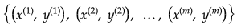
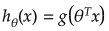
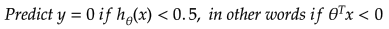
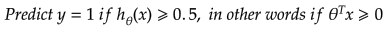
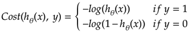
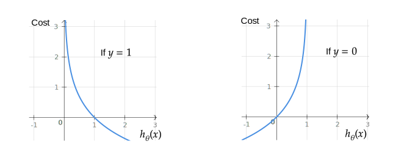
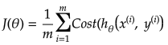
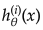
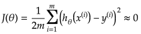
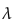

# Logistic Regression

## Jupyter Demos

▶️ [Demo | Logistic Regression With Linear Boundary](https://nbviewer.jupyter.org/github/trekhleb/homemade-machine-learning/blob/master/notebooks/logistic_regression/logistic_regression_with_linear_boundary_demo.ipynb) - predict Iris flower `class` based on `petal_length` and `petal_width`

▶️ [Demo | Logistic Regression With Non-Linear Boundary](https://nbviewer.jupyter.org/github/trekhleb/homemade-machine-learning/blob/master/notebooks/logistic_regression/logistic_regression_with_non_linear_boundary_demo.ipynb) - predict microchip `validity` based on `param_1` and `param_2`

▶️ [Demo | Multivariate Logistic Regression | MNIST](https://nbviewer.jupyter.org/github/trekhleb/homemade-machine-learning/blob/master/notebooks/logistic_regression/multivariate_logistic_regression_demo.ipynb) - recognize handwritten digits from `28x28` pixel images.

▶️ [Demo | Multivariate Logistic Regression | Fashion MNIST](https://nbviewer.jupyter.org/github/trekhleb/homemade-machine-learning/blob/master/notebooks/logistic_regression/multivariate_logistic_regression_fashion_demo.ipynb) - recognize clothes types from `28x28` pixel images.

## Definition

**Logistic regression** is the appropriate regression analysis to conduct when the dependent variable is dichotomous (binary). Like all regression analyses, the logistic regression is a predictive analysis. Logistic regression is used to describe data and to explain the relationship between one dependent binary variable and one or more nominal, ordinal, interval or ratio-level independent variables.

Logistic Regression is used when the dependent variable (target) is categorical.

For example:

- To predict whether an email is spam (1) or (0).
- Whether online transaction is fraudulent (1) or not (0).
- Whether the tumor is malignant (1) or not (0).

In other words the dependant variable (output) for logistic regression model may be described as:

## Training Set

Training set is an input data where for every predefined set of features _x_ we have a correct classification _y_.

_m_ - number of training set examples.

For convenience of notation, define:

## Hypothesis (the Model)

The equation that gets features and parameters as an input and predicts the value as an output (i.e. predict if the email is spam or not based on some email characteristics).

Where _g()_ is a **sigmoid function**.

Now we my write down the hypothesis as follows:

## Cost Function

Function that shows how accurate the predictions of the hypothesis are with current set of parameters.

Cost function may be simplified to the following one-liner:

## Batch Gradient Descent

Gradient descent is an iterative optimization algorithm for finding the minimum of a cost function described above. To find a local minimum of a function using gradient descent, one takes steps proportional to the negative of the gradient (or approximate gradient) of the function at the current point.

Picture below illustrates the steps we take going down of the hill to find local minimum.

The direction of the step is defined by derivative of the cost function in current point.

Once we decided what direction we need to go we need to decide what the size of the step we need to take.

We need to simultaneously update  for _j = 0, 1, ..., n_

 - the learning rate, the constant that defines the size of the gradient descent step

 - _jth_ feature value of the _ith_ training example

 - input (features) of _ith_ training example

_yi_ - output of _ith_ training example

_m_ - number of training examples

_n_ - number of features

> When we use term "batch" for gradient descent it means that each step of gradient descent uses **all** the training examples (as you might see from the formula above).

## Multi-class Classification (One-vs-All)

Very often we need to do not just binary (0/1) classification but rather multi-class ones, like:

- Weather: Sunny, Cloudy, Rain, Snow
- Email tagging: Work, Friends, Family

To handle these type of issues we may train a logistic regression classifier  several times for each class _i_ to predict the probability that _y = i_.

## Regularization

### Overfitting Problem

If we have too many features, the learned hypothesis may fit the **training** set very well:

**But** it may fail to generalize to **new** examples (let's say predict prices on new example of detecting if new messages are spam).

### Solution to Overfitting

Here are couple of options that may be addressed:

- Reduce the number of features
    - Manually select which features to keep
    - Model selection algorithm
- Regularization
    - Keep all the features, but reduce magnitude/values of model parameters (thetas).
    - Works well when we have a lot of features, each of which contributes a bit to predicting _y_.

Regularization works by adding regularization parameter to the **cost function**:

 - regularization parameter

> Note that you should not regularize the parameter .

In this case the **gradient descent** formula will look like the following:

## References

- [Machine Learning on Coursera](https://www.coursera.org/learn/machine-learning)
- [Sigmoid Function on Wikipedia](https://en.wikipedia.org/wiki/Sigmoid_function)
- [Gradient Descent on Wikipedia](https://en.wikipedia.org/wiki/Gradient_descent)
- [Gradient Descent by Suryansh S.](https://hackernoon.com/gradient-descent-aynk-7cbe95a778da)
- [Gradient Descent by Niklas Donges](https://towardsdatascience.com/gradient-descent-in-a-nutshell-eaf8c18212f0)
- [One vs All on Stackexchange](https://stats.stackexchange.com/questions/318520/many-binary-classifiers-vs-single-multiclass-classifier)
- [Logistic Regression by Rohan Kapur](https://ayearofai.com/rohan-1-when-would-i-even-use-a-quadratic-equation-in-the-real-world-13f379edab3b)
- [Overfitting on GeeksForGeeks](https://www.geeksforgeeks.org/underfitting-and-overfitting-in-machine-learning/)
