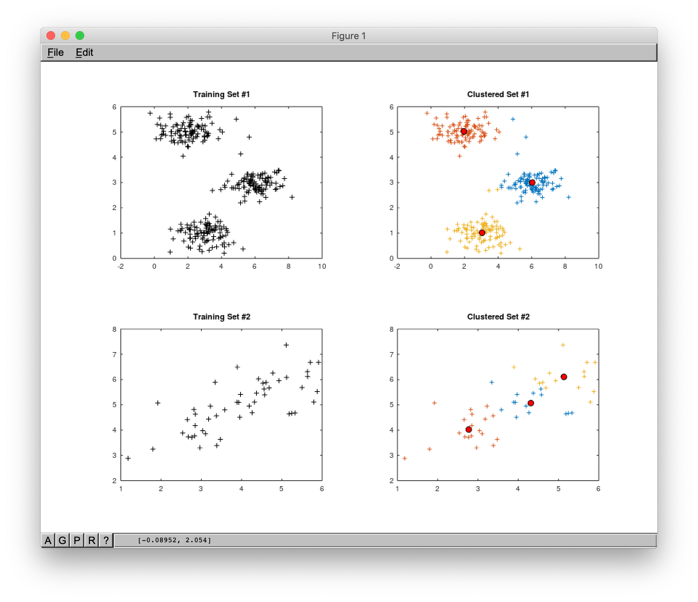

# K-Means Algorithm

**K-means clustering** aims to partition n observations into _K_ clusters in which each observation belongs to the cluster with the nearest mean, serving as a prototype of the cluster.

The result of a cluster analysis shown below as the coloring of the squares into three clusters.

## Description

Given a training set of observations:

Where each observation is a _d_-dimensional real vector, k-means clustering aims to partition the _m_ observations into _K_ (_≤ m_) clusters:

... so as to minimize the within-cluster sum of squares (i.e. variance).

Below you may find an example of 4 random cluster centroids initialization and further clusters convergence:

[Picture Source](http://shabal.in/visuals/kmeans/6.html)

Another illustration of k-means convergence:

## Cost Function (Distortion)

 - index of cluster _(1, 2, ..., K)_ to which example _x(i)_ is currently assigned.

 - cluster centroid _k_ () and .

 - cluster centroid of a cluster to which the example _x(i)_ has been assigned.

For example:

In this case optimization objective will look like the following:

## The Algorithm

Randomly initialize _K_ cluster centroids (randomly pick _K_ training examples and set _K_ cluster centroids to that examples).

## Files

- [demo.m](./demo.m) - main demo file that you should run from Octave console.
- [set1.mat](./set1.mat) - training data set #1.
- [set2.mat](./set2.mat) - training data set #2.
- [compute_centroids.m](./compute_centroids.m) - compute the next mean centroid for each cluster.
- [find_closest_centroids.m](./find_closest_centroids.m) - split training examples into cluster based on the distance to centroids.
- [init_centroids.m](./init_centroids.m) - randomly init centroids by taking random training examples.
- [k_means_train.m](./k_means_train.m) - function that runs K-Means algorithm.

### Demo visualizations

## References

- [Machine Learning on Coursera](https://www.coursera.org/learn/machine-learning)
- [K-means on Wikipedia](https://en.wikipedia.org/wiki/K-means_clustering)
